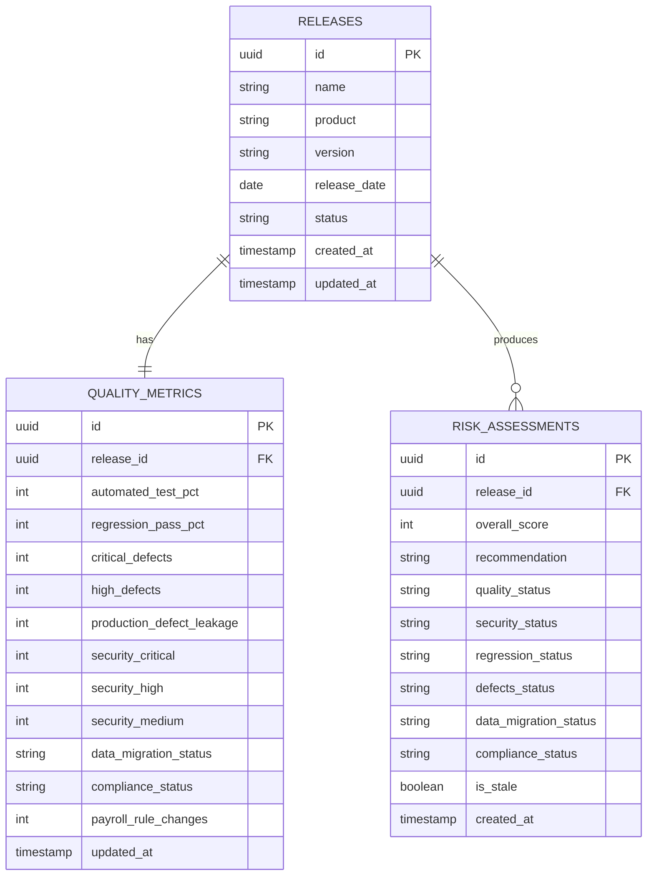

# ReleaseGuard — Database Schema

## Overview

Three tables model the core domain: `releases`, `quality_metrics`, and `risk_assessments`.
Schema changes are managed via Flyway migrations (see `db/migration/` in the codebase),
giving a versioned, auditable history of every structural change — relevant given the
compliance domain this project targets.

## Entity-relationship diagram

## Design decisions

- **`releases` ↔ `quality_metrics` is one-to-one.** Milestone 1 tracks only the current
  set of metrics per release; `quality_metrics.release_id` is unique.
- **`releases` ↔ `risk_assessments` is one-to-many**, even though only one row exists per
  release today. This is a deliberately reserved seam: a future score-history feature can
  simply stop overwriting and start inserting new rows, with no schema redesign required.
- **`is_stale` on `risk_assessments`** supports the reopen workflow (see US6 in
  `user-stories.md`): reopening a release marks its current assessment stale rather than
  deleting it, so the dashboard can show "this score is out of date" instead of losing
  the record.
- **`releases.status`** enforces the `DRAFT` / `ASSESSED` lifecycle at the database level
  via a check constraint, not just in application code.
- **`UNIQUE (product, version)`** on `releases` prevents two releases of the same product
  from sharing a version number.

## Migrations

Schema changes are applied via Flyway, in `src/main/resources/db/migration/`.
`V1__init_schema.sql` creates all three tables above.
